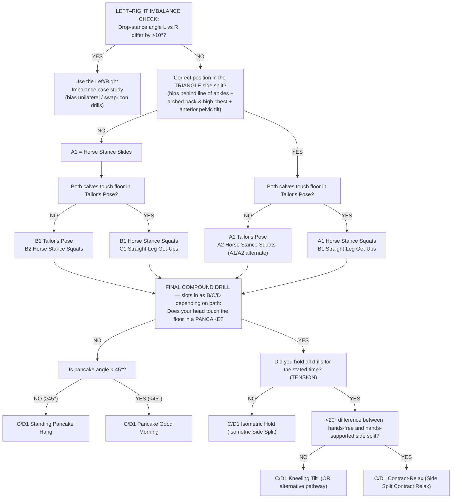

# Source — MFTK *Side Split Toolkit* (purchased course)

> **Provenance.** Matt Smith's **Side Split Toolkit**, part of his *Mobility & Flexibility Toolkit (MFTK)*. Hosted at `matthewismith.com` (member-gated). Captured 2026-06-14 from Andy's enrolled account (23% complete at capture).
>
> **What this file is.** A structured capture of the course's *curriculum, methodology, drill library, phase model, and programming parameters* — the productized, side-split-specific version of the methodology that the [`guide.md`](../guide.md) previously had to infer from the single free YouTube video. This is the source the guide's §14 NOTE asked for.
>
> **Fidelity caveat (read before trusting any number).** The course is **overwhelmingly video- and embedded-tool-based**. Only a few lessons render as extractable text; the rest are video walkthroughs, embedded interactive "program builder" tools, and image cheatsheets that can't be transcribed here. So:
> - **Curriculum / drill names / lesson structure** below = **high confidence** (read directly from the course navigation).
> - **"When and How Often to Train"** = **high confidence** (one of the few text lessons; paraphrased below, not reproduced verbatim, for copyright).
> - **Per-drill sets/reps/tempo/load** = **NOT captured** — those live in the videos and the embedded Phase 1 / Phase 2 program-builder tools. Where the guide gives loading numbers, they remain *derived from method principles*, not lifted from the course. Flagged throughout.
> - Do **not** reproduce course video content verbatim; this is a paid product. Capture structure and principles only.

---

## 1. Course curriculum (table of contents)

The Side Split Toolkit is organized as a methodology course → assessment → program builders → drill library → programming theory. Sections, in course order:

**Introduction / Workshops** — Welcome, Disclaimer, in-person events.

**Getting Started** — *When and How Often to Train* · How to Start Your First Program · How to Read Your Program · Downloads · Equipment List.

**Fundamental Training Theory** — Warm Up · Mastering the Basics (Training Tips) · How to Progress Session to Session · MFTK Training Cheatsheet (PDF).

**Goal Setting** — Goal Setting + worksheet.

**Intermediate Training Theory** — *Mobility Blueprint: How to Get Flexible Once and Keep it Forever* (the productized version of the free YouTube blueprint) · How Should Stretching Feel?

**Measuring Progress** — Measuring Progress · How to Measure Angles with an App.

**Mindset of Mobility Training.**

**Alternative Progression Methods** — **Progressive Underload** · **Go Deeper, Not Heavier**.

**Types of Flexibility** — Part 1 Passive vs Active · Part 2 Static vs Dynamic · Part 3 Stretching Methods.

**Mechanics & Anatomy** — Mechanics of a Side Split · Side Split Positioning (FlexView Anatomy).

**Assessment & Phase 1 Program** — 1. Side Split Assessment · 2. Side Split Measuring Angles · 3. Side Split Phase 1 Program Builder.

**Program Design** — **Side Split Drill Matrix** · **Phase 2 & Beyond Program Builder [BETA]**.

**Specialist Programs** — **Side Split Overload | Specialist Program**.

**Case Studies** — Training Side Split and Pancake Together · Side Split Left/Right Imbalance · Side Split Potential · Theo Necker (Side Splits in One Session) · How to Not Get Stuck in Your Side Splits (with Sondre Berg).

**Side Split Drills** — see §3 (the named drill library).

**Basic Program Design** — Intro · Order of Exercise · Manipulating Tempo · Time Under Tension & Number of Reps · Sets & Rest · Summary Sheet.

**Programming Parameters** — Overview · Reps · Tempo · Sets · Rest · Order of Execution (A1/A2) · Phases & Training Cycles Explained.

**Extras / FAQ** — Choosing a Dumbbell · Mobility for Climbers · Gua Sha · Discounts · FAQ.

---

## 2. "When and How Often to Train" (paraphrased — the load-bearing scheduling lesson)

This is the single most actionable text lesson for integrating the toolkit into an existing training week. Paraphrased:

**Dose-finding philosophy.** *Start low and build up.* Find the **minimum effective dose** that produces improvement, then gradually raise toward the **optimal effective dose** that maximizes progress. More is not better by default — you climb to it.

**Starting frequency (per skill).** Begin at roughly **1 session per 5 days**, *or* **1–2× per week**.

**Spreading 2 sessions.** When at 2×/week, **space the two sessions apart** (don't stack them). Suggested pairings: Mon+Thu, Mon+Fri, Tue+Fri, Tue+Sat, Wed+Sat, Wed+Sun, Thu+Sun.

**Two skills at once.** Start with **1 session for each skill per week** before adding more.

**Combining with strength training / sport that could interfere — three options:**
1. **Same-day AM/PM split** — do the interfering sport/strength in the morning, flexibility in the evening.
2. **Leave ≥2 days** after the sport/strength session before the flexibility session.
3. **Flexibility immediately after** the sport/strength session — but **reduce the volume of both**.

> This corroborates the guide's §13 three-tier scheduling rule (originally inferred from the free video) — the paid course states the same three configurations explicitly. The guide's §13 can now be treated as course-confirmed, not inferred.

---

## 3. Named side-split drill library (the "Side Split Drills" section)

The course's drill library. These are the named exercises the guide's §5 table was missing. **Loading parameters (sets/reps/tempo/hold) are in the per-drill videos and were not captured** — map these to method/role here; pull loading from method principles in `exercise-selection.md` until the videos are transcribed.

| Drill (course name) | Primary method | Role | Notes |
|---|---|---|---|
| Horse Stance Slides | Isometric / active slide | isolation→compound | Width-building under control |
| Slide to Side Split | Dynamic / active | compound | Entry into full width |
| Tailors Pose — Overview & Positioning | PIR / isometric holds | isolation | Bent-leg adductor opener (the "Taylor's pose family" the guide references) |
| Tailors Pose — Progression & Underload | progressive underload | isolation | How to regress load to keep depth (see §4) |
| Tailors Pose — Straight Arm Lifts | active lift | isolation | Strength-in-range bias |
| Pancake Good Morning — Round Back | isometric holds for reps | isolation | Hip-tilt range; rounded back permitted (matches guide §8) |
| Adductor Flyes | active lift (± eccentric) | isolation | Strength-in-range for adductors |
| Horse Stance Squats — Overview & Positioning | isometric holds for reps | isolation/compound | "Horse squat reps > horse isometric" (guide §5 / exercise Method 3) |
| Horse Stance Squats — How to Measure & Progress | — | measurement | Progression tracking for the horse stance |
| Drop Stance Squats | active / loaded | isolation | Loaded adductor strength through range |
| Straight Leg Get Ups — Hands Free | active lift | isolation | Active strength-in-range, no assist |
| Straight Leg Get Ups (Straddle Ups) — Hands Assisted | active lift (assisted) | isolation | Regressed version of hands-free |
| Kneeling Tilt — Measuring & Progression | technique + isometric | technique/compound | Hip-tilt mechanic; the key anti-bone-jam drill |
| Kneeling Tilt — Closed Hip | technique | technique | Hip-position variant |
| Isometric Side Split | isometric holds for reps | compound | The target-skill hold |
| Supported Side Split | isometric (assisted) | compound | Regressed/supported target hold |
| Side Split Contract Relax | PIR (contract-relax) | compound | C-R finisher at depth |
| Standing Pancake Hang — Contract Relax | PIR | isolation | Standing variant, hamstring/adductor |
| Hip External Rotation Good Mornings | active / isometric | isolation | ER-biased — the "point feet up" alignment the guide §8 names |
| Over Pancake Isometrics — Feet & Leg Elevated | isometric holds | isolation | Elevated overload variant |

---

## 4. Methodology refinements the course adds beyond the free video

- **Progressive Underload** (named method). Rather than always adding load/depth, *reduce* load (or assistance) to keep training quality high and keep accumulating reps in good positions. A deliberate de-loading lever inside a build phase — useful on fatigued weeks and for skill exposure days.
- **Go Deeper, Not Heavier** (named method). Bias progression toward **depth/range** before **external load**. Directly relevant for an already-strong athlete (Andy): don't reach for ankle weights when added depth at bodyweight is still available.
- **Phase model (concrete).** The course operationalizes the guide's generic Build/Realize/Maintain into named, tool-backed stages for the side split specifically:
  1. **Assessment** (Side Split Assessment + measuring angles).
  2. **Phase 1 Program** (beginner builder).
  3. **Phase 2 & Beyond Program** (intermediate+ builder).
  4. **Side Split Overload** (specialist program — advanced loading).
- **Angle-based measurement.** The course measures the side split by **angle, via a phone app** ("How to Measure Angles with an App" + "Side Split Measuring Angles"), not only by hip-to-floor distance.
- **Programming Parameters taught explicitly** (Reps / Tempo / Sets / Rest / Order of Execution A1·A2 / Phases & Training Cycles) — i.e., the course supplies the per-tier loading scheme the guide §7 marked TODO. **The specific numbers are in the videos and embedded builders and remain uncaptured** — transcribe these to fully retire the guide's §7 TODO.

---

## 5. What still needs capturing (to fully retire guide TODOs)

To turn the remaining "derived/inferred" loading numbers into course-sourced ones, transcribe (from the videos / embedded builders):
- Per-drill sets × reps × tempo × hold × rest (Programming Parameters section + each drill video).
- The Phase 1 and Phase 2 program-builder outputs (the actual prescribed sessions).
- The Side Split Overload specialist loading scheme.
- Mechanics of a Side Split + FlexView positioning cues (currently only the hip-tilt/ER cue is captured, from the free video).
- The case studies (esp. "Training Side Split and Pancake Together" — relevant to Andy, whose Wed work already pairs pancake + side split).

---

## 6. Phase 1 Program Builder — FULL CAPTURE (the flowchart + how he programs)

> Captured 2026-06-14 from the embedded **"Side split program builder.pdf"** (4 pages, Google-Drive-hosted, ©Matthewismith 2020–2021) on the *3. Side Split Phase 1 Program Builder* lesson. This is **high-confidence, read directly from the document** — it's the answer to "how does he decide which drill to do, and how does he program it." Three-step flow the builder teaches: **① Drill Selection (flowchart) → ② Program Parameters (per-drill reps/sets/tempo/rest) → ③ Plan Phase 1 (write it on the template).**

### 6.1 Drill Selection flowchart (which drills, and in what order)

You answer questions from your **assessment results + measured angles**; the chart outputs **drill names AND the order code** (A1, A2, B1, … — the order/superset position you perform them in). **Key:** a ⇄ "swap" icon = the drill may be swapped for a *unilateral* version if you have a left/right imbalance; a dashed line = optional / alternative pathway.

**How to read the order codes:** letters = sequence (A before B before C/D); two drills sharing a letter (A1 & A2) are **supersetted / done alternately**; the number is the slot within that letter. The compound drill from the pancake branch becomes the final B, C, or D entry depending on how many drills the earlier branches produced.

### 6.2 Program Parameters (Phase 1 starting numbers — *the actual loading*)

> "Each rep, set, tempo and rest has been deliberately chosen as both a solid starting point and a teaching tool to familiarise you with the role of each variable."
>
> **Tempo notation = 4 digits: [eccentric / lower] [pause at bottom] [concentric / lift] [pause at top].** A `-` means that portion isn't actively performed. Contract-relax drills use a `contract-s / relax-s` notation instead.

| Category | Drill | Reps | Sets | Tempo | Rest | Key notes |
|---|---|---|---|---|---|---|
| **Technique** | Horse Stance Slides | **10C** (cluster: 1 rep → rest 10 s → next rep) | 1 | **51-0** | 60 s | "Not meant to be hard — purely practising the side-split position." 51-0 = 5 s lower, 1 s pause bottom, push up via hands (not lifting that portion → `-`), no pause at top |
| **Loaded stretching** | Tailor's Pose | 8 | 3–4 | **2310** | 60–90 s | Start **5–10 kg/side**; "depth & ROM, not how much you can lift." 2310 = 2 s lower, 3 s pause bottom, 1 s lift, 0 s top |
| **Loaded stretching** | Horse Stance Squats | 8 | 3–4 | **2310** | 60–90 s | Progress via **weight + step width** |
| **Loaded stretching** | Drop Stance Squats | 8 / side | 2–3 | **2310** | 45 s | **Unilateral** — weaker side first, rest 15 s, match on stronger side = 1 set. Start **bodyweight**, ROM first |
| **Active** | Straight-Leg Get-Ups (hands free) | **6 + 10 s hold on last rep** | 3–4 | **2013** | 60–90 s | 2013 = 2 s lower, 0 s bottom, 1 s lift, 3 s pause top |
| **Active** | Kneeling Tilt (closed hip) | 5 / side | 2–3 | **1113** | 60 s | **Unilateral**, weak side first. 1113 = 1 s lower, 1 s rest on floor, 1 s lift, 3 s hold top |
| **Loaded (compound opener)** | Pancake Good Morning | 6 | 3–4 | **3220** | 60–90 s | Weight that **pulls you deeper** (~5–10 kg), not a max. 3220 = 3 s lower, 2 s bottom, 2 s lift, 0 s top — "intense; don't rest at top" |
| **Contract-Relax** | Standing Pancake Hang | 6 cycles (5 s contract / 5 s relax) = 1 set | 2–3 | 5 s / 5 s | 90 s | Internal pull (no visible lift); rest between sets, not in the hang |
| **Contract-Relax** | Side Split Contract-Relax | 3 (each rep = agonist 5 s/5 s **then** antagonist 5 s/5 s) | 2–3 | 5 s/5 s ×2 | 90 s | Agonist = drive heels into floor; antagonist = try to lift feet. Get a little deeper each relax |
| **Isometric** | Isometric Side Split | **40–60 s hold** | 2–3 | — | 60–90 s | Width you can *just* hold 40 s; progress **width first, then hold time**. Should feel near-max |

### 6.3 Example Phase 1 program (the builder's worked output)

| Order | Exercise | Reps | Sets | Tempo | Rest |
|---|---|---|---|---|---|
| **A1** | Horse stance slides | 10C | 1 | 51-0 | 60 s |
| **B1** | Tailor's pose | 8 | 3–4 | 2310 | 60–90 s |
| **B2** | Horse stance squats | 8 | 3–4 | 2310 | 60–90 s |
| **C1** | Standing pancake hang | 6 | 2–3 | 5 s contract / 5 s relax | 90 s |

### 6.4 Training frequency (recovery-gated)

**Flow:** start **once every 5 days** → *if you recover well & improve each session* → **once every 4 days** → **once every 3 days.**
**The rule:** *train when your body is recovered* ("a time and place to break this exists in the specialist programs, but the majority of flexibility training is not the time to break it").

| Recovery quality | Train every |
|---|---|
| Poor | 6–7 days |
| Average | 3–5 days |
| Superior | 2–3 days |

### 6.5 When to start Phase 2

Keep running Phase 1 **until you stop progressing** — for most people **4–6 weeks** — then **write a Phase 2 program using the Drill Matrix and by modifying the template.**
